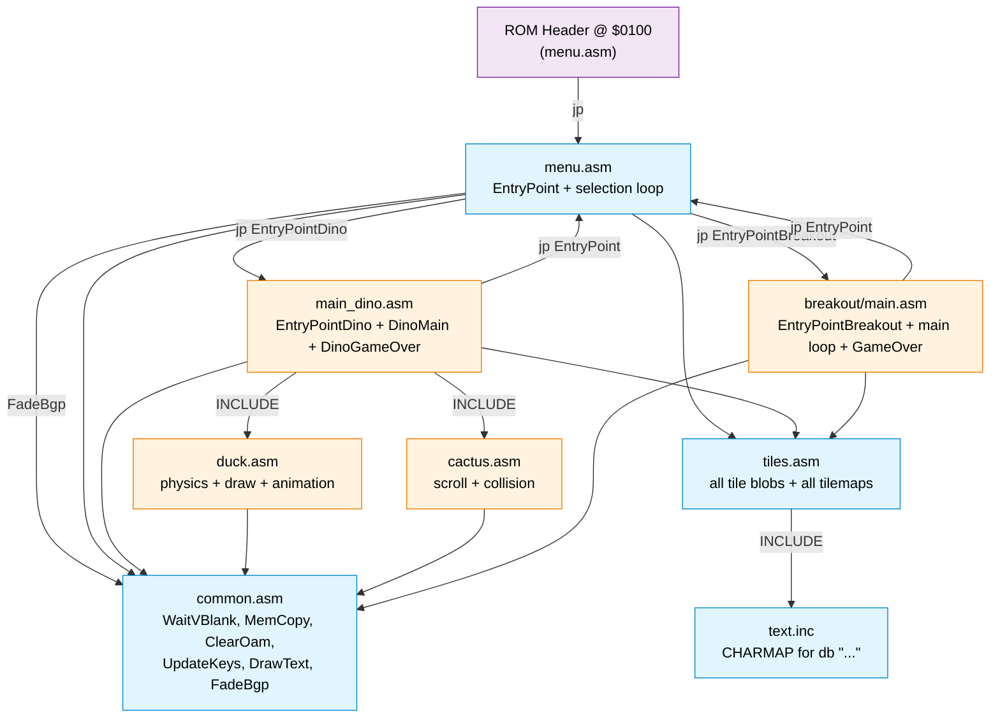
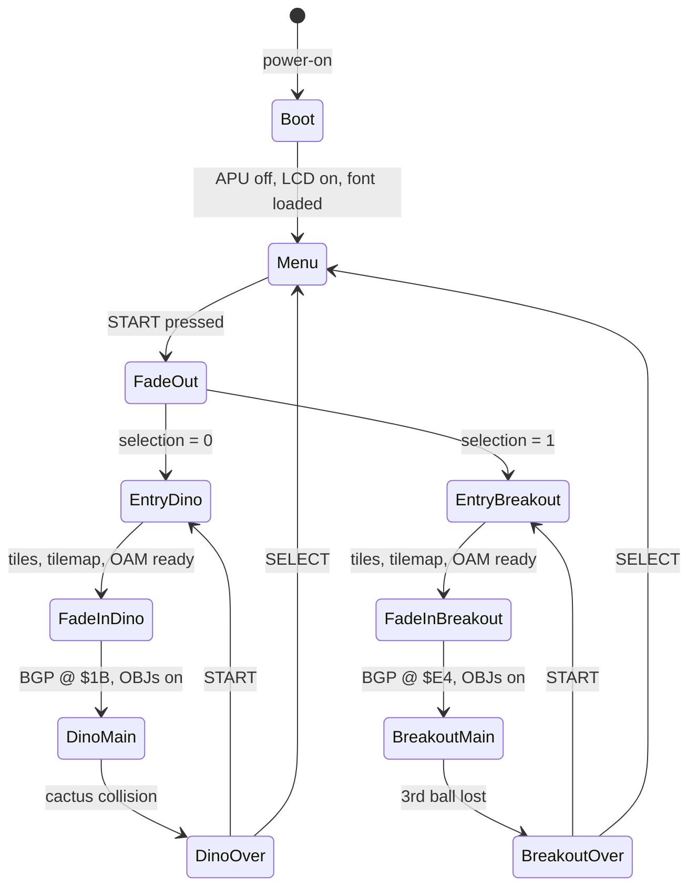
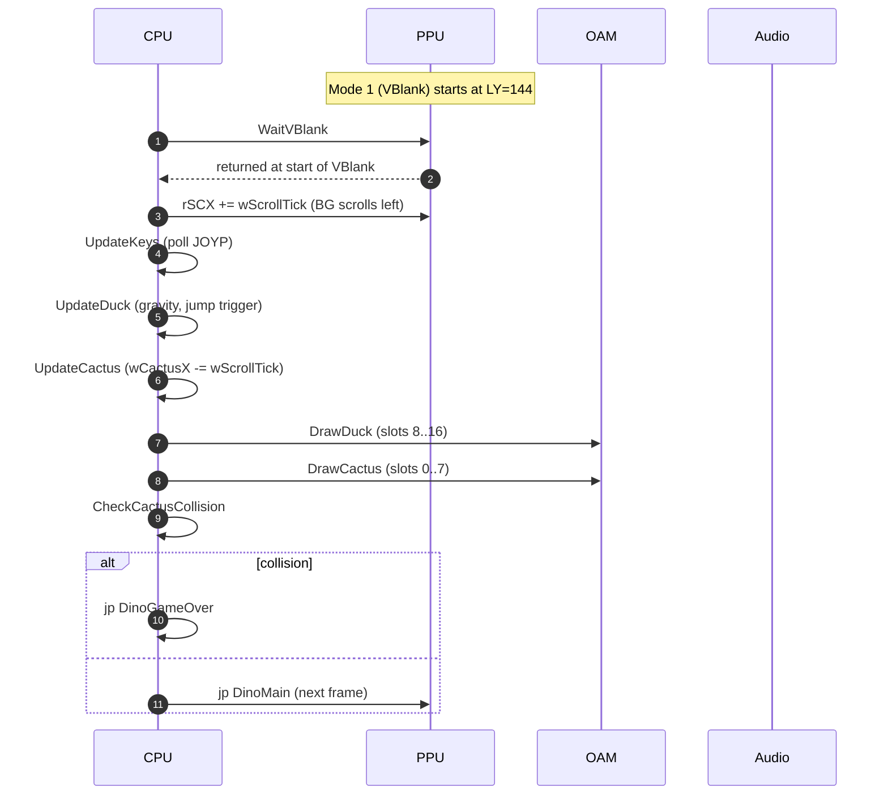

# Architecture

This document is the deep dive. For a quick overview see the
[main README](../README.md).

---

## Module dependency graph



`Menu` is in both the "shared" group and the "header owner" group — it
defines the ROM's entry symbol *and* contains the selection logic.

---

## State machine



---

## Per-frame loop (Dino)

The order of operations during one frame of `DinoMain`:



OAM writes happen during **mode 1 (VBlank)** so they never race with
the PPU's OAM scan in mode 2 — that's the entire reason `WaitVBlank`
is the *first* thing the loop does.

---

## Per-frame loop (Breakout)

```mermaid
sequenceDiagram
    autonumber
    participant CPU
    participant PPU
    participant OAM
    participant BGMap as $9800

    CPU->>PPU: WaitVBlank
    CPU->>OAM: ball X += wBallMomentumX
    CPU->>CPU: wFrameCounter++; if 4 → UpdateBreakingList
    CPU->>BGMap: brick tiles age (cracked → broken → blank)
    CPU->>OAM: ball Y += wBallMomentumY

    Note over CPU: Sample BG tile around the ball
    CPU->>BGMap: GetTileByPixel (top, right, left, bottom)
    CPU->>BGMap: CheckAndHandleBrick → mark $23/$24 cracked + queue
    CPU->>CPU: IsWallTile? → invert ball momentum

    CPU->>CPU: paddle bounce check
    CPU->>CPU: UpdateKeys
    CPU->>OAM: paddle X += LEFT/RIGHT
    CPU->>PPU: jp BreakoutMain
```

---

## Memory map (cartridge.gb — 32 KB ROM)

```
                ROM (read-only)                     RAM
$0000 ┌────────────────────────────────┐  $A000 ┌──────────────────┐
      │ Bank 0: Header @ $0100         │        │ external RAM     │
      │ EntryPoint (menu.asm)          │        │   (unused)       │
      │ Common code, menu, tiles, both │        └──────────────────┘
      │ games, all tilemaps. Fits in   │  $C000 ┌──────────────────┐
      │ ~12 KB so we never need bank 1.│        │ WRAM             │
$3FFF └────────────────────────────────┘        │  Common WRAM     │
                                                │  Menu WRAM       │
              VRAM (from PPU)                   │  Dino WRAM       │
$8000 ┌────────────────────────────────┐        │  Duck State      │
      │ OBJ tiles                      │        │  Cactus State    │
      │  $00..$0E   duck (dino mode)   │        │  Breakout WRAM   │
      │  $19..$20   cactus (dino mode) │  $DFFF └──────────────────┘
      │  $00, $01   paddle, ball       │
      │             (breakout mode)    │  $FE00 ┌──────────────────┐
$8FFF └────────────────────────────────┘        │ OAM (40 sprites) │
$9000 ┌────────────────────────────────┐        │  see OAM layout  │
      │ BG tiles                       │        │  below           │
      │ tile $00 = $9000               │  $FE9F └──────────────────┘
      │  breakout: 46 tiles ($00..$2D) │
      │  dino:     12 tiles ($00..$0B) │  $FF00 ┌──────────────────┐
$92DF └────────────────────────────────┘        │ I/O registers    │
$9800 ┌────────────────────────────────┐        │  JOYP, NR*, LCDC,│
      │ BG tilemap (32×32 = 1024 B)    │        │  SCY/SCX, BGP,   │
      │ wiped + reloaded at every      │        │  OBP0/1, etc.    │
      │ scene transition               │  $FFFF └──────────────────┘
$9BFF └────────────────────────────────┘
```

### OAM layout — Dino

```
slot   0  1  2  3  4  5  6  7   8  9 10 11 12 13 14 15 16 ...
tile  19 1A 1B 1C 1D 1E 1F 20   00 01 02 03 04 05 06 07 08
        cactus 4×2                 duck 3×3 (body + feet)
        rows 1-4, cols 1-2         body $00..$05, feet $06..$0E

scanline overlap analysis: each scanline intersects one duck row
(3 sprites) and at most one cactus row (2 sprites) = 5 OBJs per
scanline, well under the 10-sprite hardware limit.
```

### OAM layout — Breakout

```
slot   0  1  2 ... 39
       paddle ball (rest cleared, Y=0 → off-screen)
```

---

## File responsibilities (one-liner each)

| File                          | Owns                                                                |
| ----------------------------- | ------------------------------------------------------------------- |
| `src/menu.asm`                | ROM Header at `$0100`; `EntryPoint`; menu cursor/state; dispatcher  |
| `src/common.asm`              | `WaitVBlank`, `MemCopy`, `ClearOam`, `UpdateKeys`, `DrawText`, `FadeBgp` + tables |
| `src/tiles.asm`               | every tile blob, every tilemap (4 of them), `INCLUDE`s `text.inc`   |
| `src/text.inc`                | `CHARMAP` translating ASCII → tile indices for `db "..."`           |
| `src/dino_game/main_dino.asm` | `EntryPointDino`, `DinoMain`, `DinoGameOver`, `wScrollTick`         |
| `src/dino_game/duck.asm`      | duck physics, foot animation, OAM rendering                         |
| `src/dino_game/cactus.asm`    | cactus scroll, AABB collision, OAM rendering                        |
| `src/breakout/main.asm`       | `EntryPointBreakout`, ball physics, brick break-animation, paddle, GameOver |

---

## DMG hardware concepts the ROM relies on

- **Mode 1 (VBlank)** — the only mode where unrestricted writes to OAM
  and VRAM are safe. `WaitVBlank` is called at the top of each game's
  main loop so all subsequent draws land in this window.
- **Sprite priority on tied X** — DMG: lower OAM index wins. We
  exploit this in dino by putting the cactus *before* the duck so the
  cactus draws on top of the duck where they horizontally align.
- **10 sprites per scanline** — hardware drops sprites past the 10th.
  Dino's setup peaks at 5 sprites/scanline so we have plenty of
  headroom.
- **`LCDC.4 = 0`** — selects "BG/Window tile data area = $8800-$97FF
  with signed indexing". `$9000` corresponds to tile index 0. Both
  games use this mode.
- **APU power state at boot** — boot ROM leaves CH1 in a state where
  the next NRxx write can produce a click. We power the APU off
  (`xor a; ldh [rNR52], a`) at the very top of `EntryPoint`.

---

## Build pipeline

```
src/*.asm  ──rgbasm──▶  build/obj/*.o  ──rgblink──▶  build/cartridge.gb
                                                          │
                                              rgbfix -p0 -v (header
                                              checksum + Nintendo logo)
                                                          │
                                                          ▼
                                                   ./cartridge.gb
```

`Makefile` has explicit `SRC_FILES` rather than wildcard discovery so
adding a module is a deliberate one-line edit. The `INC_DIR` is just
`include/` (where `hardware.inc` lives); `INCLUDE`s with a `src/`
prefix work because rgbasm resolves them relative to the project
root.
